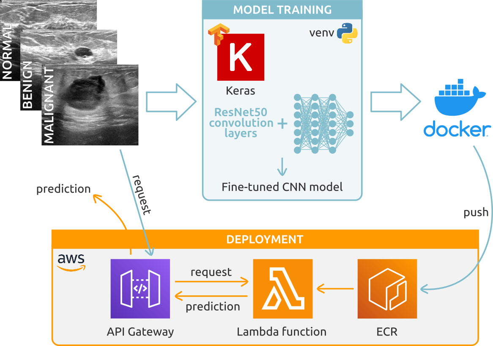

# Breast Cancer Classifier

* [Project Overview](#project-overview)
    * [Dataset](#dataset)
    * [Technologies](#technologies)
    * [Workflow](#workflow)
* [How To Run](#how-to-run)
    * [Initial setup](#initial-setup)
    * [Training pipeline](#training-pipeline)
    * [Inference pipeline](#inference-pipeline)
* [Project Details](#project-details)
* [Future Directions](#future-directions)


# Project Overview

Breast cancer is one of the most prevalent cancers worldwide, with estimates suggesting that 1 in 8 women will be affected during their lifetime. While advancements in treatment have reduced mortality rates, the timing of diagnosis plays a critical role in prognosis. Early detection significantly improves treatment efficacy, leading to better survival rates and quality of life for patients, as well as reduces the burden on healthcare systems.

Ultrasound imaging is commonly used for breast cancer screening and diagnosis due to its non-invasive nature and accessibility. However, it has limitations. Differentiating between normal tissue, benign masses, and malignant tumors can be challenging, potentially leading to missed or false diagnoses. This creates a need for more advanced diagnostic tools. In this context, AI tools can offer assistance to radiologists, potentially leading to earlier interventions.

In this project, I developed a Deep Learning-based approach&mdash;a Convolutional Neural Network (CNN)&mdash;to classify breast ultrasound images into normal, benign or malignant, achieving an overall 85% accuracy. I also wrapped the model and necessary scripts into a Docker container and prepared it for deployment, either local or as a web service.

### Dataset:

I used the **Breast Ultrasound Images Dataset**, available at: https://www.kaggle.com/datasets/aryashah2k/breast-ultrasound-images-dataset/ [1]. This dataset includes breast ultrasound images, each associated with a mask image, categorized into three classes: normal, benign and malignant.

[1] Al-Dhabyani W, Gomaa M, Khaled H, Fahmy A. (2020) Dataset of breast ultrasound images. *Data in Brief*. 28:104863. DOI: [10.1016/j.dib.2019.104863](https://doi.org/10.1016/j.dib.2019.104863).

### Technologies:

* Programming language: **Python (numpy, matplotlib)**
* Deep Learning: **TensorFlow and Keras**
* Virtual environment: **venv**
* Containerization: **Docker**
* Deployment: **AWS Lambda and API Gateway**
* Version control: **Git and GitHub**

### Workflow:




# How To Run

This project includes (i) a [Training pipeline](#training-pipeline) and (ii) an [Inference pipeline](#inference-pipeline).

## Initial setup

#### 1. Clone the project repository:

```bash
git clone https://github.com/LaboraTORIbio/breast_cancer_classifier.git
cd breast_cancer_classifier
```

#### 2. Dowload and setup the dataset:

Download the [Breast Ultrasound Images Dataset](https://www.kaggle.com/datasets/aryashah2k/breast-ultrasound-images-dataset/) and place it in `./data/full`, inside the main project directory. The downloaded dataset includes three directories, one for each class, containing both ultrasound and mask images.

This project only uses ultrasound images for classification (see [Project Details](#project-details)). Run the following code in a terminal, from the main project directory, to create a new directory containing only ultrasound images (`./data/us_only`):

```bash
if [ ! -d "./data/us_only" ]; then \
    echo "Creating directory ./data/us_only"; \
    cp -r ./data/full ./data/us_only && \
    rm -rf ./data/us_only/*/*mask*; \
else \
    echo "Directory ./data/us_only already exists"; \
fi
```

#### 3. Set up the virtual environment:

To create and activate a virtual environment, run the following commands from the main project directory:

```bash
python -m venv breast-cancer-classifier
source ./breast-cancer-classifier/bin/activate
```

To deactivate the virtual environment, simply run `deactivate`.

#### 4. Install required dependencies:

```bash
pip install requirements.txt
```

## Training pipeline

The training pipeline `train.py` can be run from the main project directory:

```bash
# With default arguments:
python train.py
# Alternatively, the input (ultrasound images) and output (exported model in tflite format) file paths can be specified:
python train.py -i ./data/us_only -o ./breast_cancer_classifier.tflite
```

The pipeline will (1) split the dataset into training, validation and test, (2) load and preprocess the ultrasound images, (3) train a fully connected neural network on top of the frozen ResNet50 convolution layers, (4) fine-tune the outer convolution layers of ResNet50 with the traning data, (5) evaluate the model, and (6) output the best performing model in terms of validation accuracy, in .keras and .tflite formats (please, note that a seed was not set, so different results will be obtained everytime the pipeline is run).

## Inference pipeline

The inference pipeline can be containerized to deploy it either locally or as a web service.

#### 1. Build the Docker image:

```bash
docker build -t breast-cancer-classifier .
```

The image incorporates all necessary libraries, the model and the lambda function, which includes code for image preprocessing and inference. 

#### 2. Make predictions:

Predictions&mdash;both in local and cloud-based deployment&mdash;can be made by running the `test.py` script. This script can accept an image from an URL (line 45) or a local path (line 50), and it converts the image to its base64 string to send as request. When `lambda_function.py` recieves the request, it first converts the base64 string back as an image, processes it according to the ResNet50 requirements, and makes and returns the predictions. The URL and local image provided by default in `test.py` correspond to malignant tumors.

* **Locally:**

    Run the container of the inference pipeline:

    ```bash
    docker run -it --rm -p 9000:8080 breast-cancer-classifier:latest
    ```

    Once the container is running, you can send requests to classify breast ultrasound images. First, make sure line 38 of `test.py` is uncommented and line 39 is commented, then run:

    ```bash
    python test.py
    ```
    
    

* **Web service:**

    The inference pipeline can be served as a web service through the AWS Lambda function. First, create an [AWS account](https://aws.amazon.com/) and an [IAM user](https://docs.aws.amazon.com/IAM/latest/UserGuide/id_users_create.html), giving the user permission for AWS Lambda and AWS ECR tasks. Then, install and configure the AWS CLI, [authenticating using the IAM user credentials](https://docs.aws.amazon.com/cli/v1/userguide/cli-authentication-user.html):

    ```bash
    pip install awscli
    aws configure
    ```
    
    Next, the Docker container must be published to the **AWS Elastic Container Registry (ECR)**, through the AWS CLI:

    ```bash
    # Create a container registry:
    aws ecr create-repository --repository-name breast-cancer-classifier
    # Save the repository URI in a variable, something like:
    REPOSITORY_URI=user.dkr.ecr.region.amazonaws.com/breast-cancer-classifier
    # (note: replace user and region by your own)
    # Generate the REMOTE_URI by concatenating the repository URI to the image tag:
    TAG=breast-cancer-classifier-v1
    REMOTE_URI=${REPOSITORY_URI}:${TAG}
    # Login to the registry:
    $(aws ecr get-login --no-include-email)
    # Tag and push image to ECR:
    docker tag clothing-model:latest ${REMOTE_URI}
    docker push ${REMOTE_URI}
    ```
    
    Now, the **AWS Lambda function** can easily be created from the container image: Lambda > Functions > Create function > Container image > Enter function name (breast-cancer-classifier) and select the image in "Container image URI" > Create function. The Lambda function can be tested, using the base64 string of an image:

    

    Finally, the Lambda function can be exposed through **API Gateway** so that requests can be made from a local computer: API Gateway > Create API > REST API (Build) > New API, enter API name (breast-cancer-classifier) > Create API > Create resource > Give Resource name /predict > Create method > Method type: POST, Integration type: Lambda function, select the breast-cancer-classifier Lambda function > Deploy API (new stage, giving the name test).

    
    

    Now, requests can be made by running the `train.py` script, commenting line 38 and uncommenting line 39, where the Invoke URL provided by API Gateway should be provided, ended by /predit (the resource name):

    ```bash
    python test.py
    ```

    


# Project Details

The **Breast Ultrasound Images Dataset** comprises **ultrasound images** and their associated **mask images**. These are binary or multi-class images that indicates which pixels in the original image correspond to a specific region or structure (e.g. a tumor region), and can be used for segmentation tasks&mdash;the delineation of important regions (e.g. tumors) in unseen data. Masks can also aid the classification of images into different classes by making the algorithm focus on specific regions of interest.

<p align="center">
  
</p>

After **exploratory data analysis (EDA)**, I observed that some ultrasound images in the Breast Ultrasound Images Dataset had more that one associated mask image (see the [Project Notebook](https://github.com/LaboraTORIbio/breast_cancer_classifier/blob/main/project_notebook.ipynb)). Deciding which mask is the most appropriate in these cases requires specialized field knowledge. Moreover, the computation of **average images** showed that images within each class are highly heterogenous, possibly difficulting the identification of differentiating features between classes.


Considering everything, I decided to subset only **ultrasound images to train a traditional classification model, to explore the capacity of Deep Learning models in learning features of normal, benign and malignant samples without the help of segmentation masks**.

The dataset also had a **mild class imbalance**, with more examples of the class 'benign' compared to 'malignant' and 'normal' (an approximate ratio of 50/25/20), which could lead to a biased learning towards the 'benign' class. By training a **simple CNN from scratch**, I observed that **data augmentation** (random flip, rotation and zoom) did not improve model accuracy, which was in fact lower compared to the non-augmented dataset (see the [Project Notebook](https://github.com/LaboraTORIbio/breast_cancer_classifier/blob/main/project_notebook.ipynb)). In this case, data augmentation could introduce alterations to the images that cause the model to learn non-generalizable features, potentially worsening its performance. It may also worsen the effects of class imbalance. Thus, I proceeded model training with the original dataset.

Then, I trained a **CNN** for image classification through **transfer learning**, using class weights to mitigate class imbalance. For the base model, I used the convolution layers of the [ResNet50](https://keras.io/api/applications/resnet/) architecture. During a **first round of training**, I freezed the base model to prevent updating the weights of ResNet50, and trained a Neural Network of fully connected dense layers, tuning hyperparameters such as the number of dense layers, the size of these layers, dropout for regularization and learning rate. After selecting the best-performing hyperparameters, I **fine-tuned the model** by performing a second round of training, unfreezing the outermost convolution layers of ResNet50 to update its weights with the training data. This fine-tuning step increased prediction accuracy on the validation dataset, although in the expense of overfitting.

Finally, the fine-tuned final model showed an **85% accuracy on the test dataset** (see the [Project Notebook](https://github.com/LaboraTORIbio/breast_cancer_classifier/blob/main/project_notebook.ipynb)). Precision and recall indicate that the model performs well in differentiating between normal and abnormal breast tissue, but performs worse when discerning between benign and malignant cases, showing a bias towards benign predictions, probably due to the class imbalance.


In conclusion, these results highlight the power of CNNs to learn features that differentiate highly similar images belonging to different classes, even without the help of segmentation masks.

# Future Directions

The traditional CNN model could be improved by testing different data augmentation techniques, such as brightness changes, or by only augmenting unrepresented classes such as 'malignant'. Also, although the fine-tuned model performed the best in terms of validation accuracy, it also overfitted substantially. It could therefore be interesting to further test the performance of the model before fine-tuning (without updated weights in the outer convolution layers). Moreover, setting a seed for model training would ensure reproducibility of results.

Finally, a classification model could be trained using the mask images. This would theoretically improve classification accuracy significantly, by indicating the algorithm which features of the image are important for tumor diagnosis.